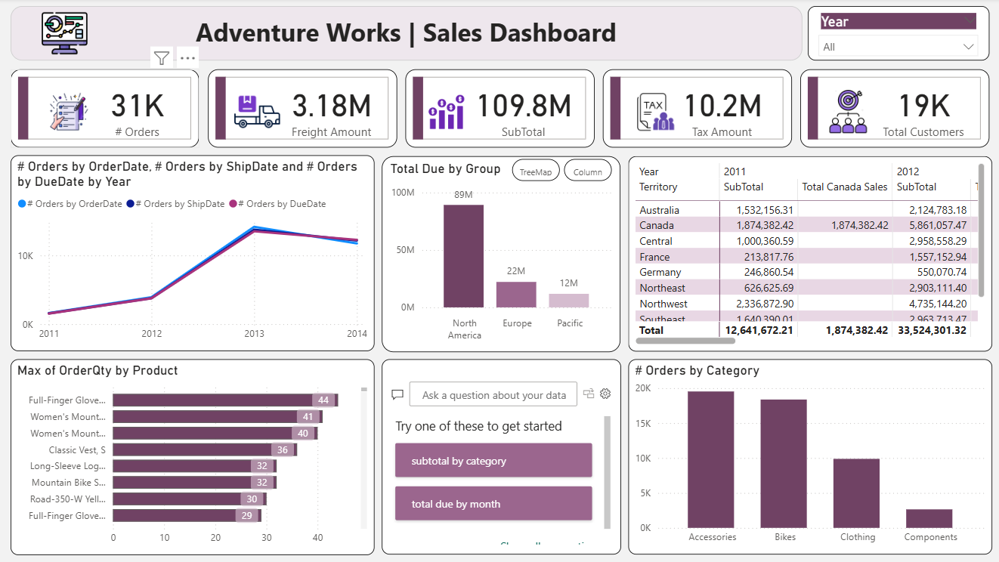
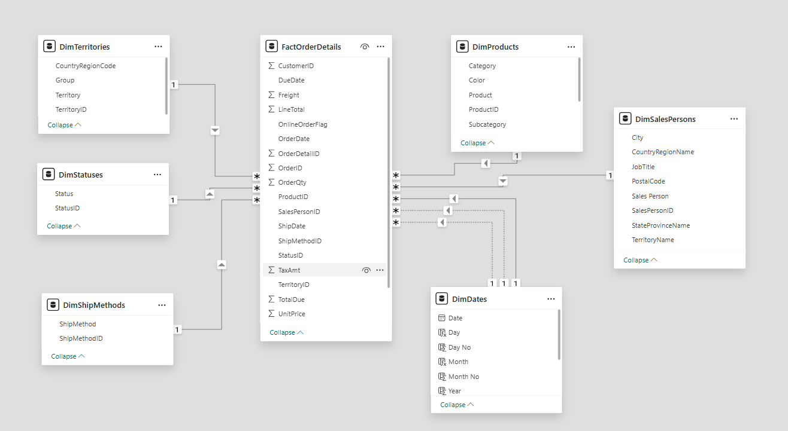
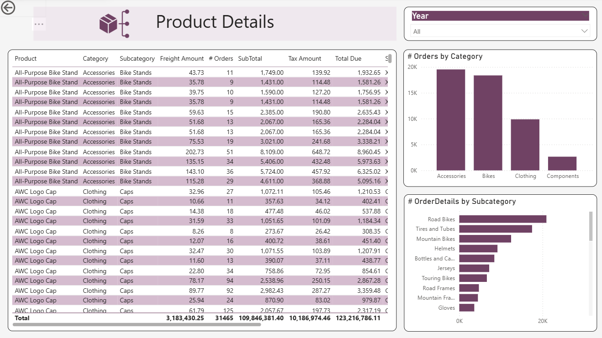
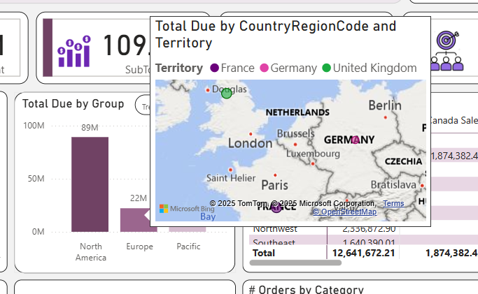
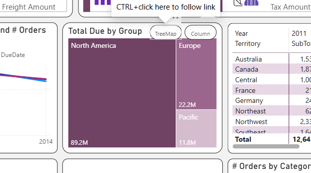

# Power-BI-Dashboard

---

## 📊 Sales Overview

**KPIs:** The top row summarizes key metrics, including **Total Orders**, **SubTotal**, and **Total Customers**.  
**Trend Analysis:** A line chart shows a strong order growth trend from **X to Y**, providing historical insight and helping to identify potential lead-time issues.  
**Geographical Distribution:** A treemap clearly identifies **North America** as the dominant sales region, supported by a detailed matrix table that breaks down sales by **Territory** and **Year**.  
**Product Performance:** Bar charts reveal the top-volume categories, while a separate chart tracks the maximum order quantity for specific products.

---

## 🧩 Data Model

A **star schema** design ensures efficient data modeling and reporting.

**Tables:**
- `DimTerritories`
- `DimStatuses`
- `DimShipMethods`
- `DimProducts`
- `DimDates`
- `DimSalesPersons`

The relationships, primarily **one-to-many**, ensure that all key metrics and attributes are correctly linked for accurate filtering and aggregation within the dashboard.

---

## 🔍 Drill-Through Functionality

A **drill-through action** from the main dashboard takes the user to a detailed **Product Details** report page.  
The page retains context with summary visuals for **#Orders by Category** and **#OrderDetails by Subcategory**, allowing for a comprehensive and detailed examination of product performance.

---

## 🗺️ Tooltip Visualization

A **tooltip** provides geographic context by visualizing **Total Due by Region Code and Territory**, plotting sales data geographically with specific points highlighted for individual regions.

---

## 🎛️ Interactive Buttons

These **buttons** allow the user to easily switch between a **treemap view** and a **column chart view** for geographical sales data, enhancing analytical flexibility and interactivity.

---

## 📈 Additional Recommendations

- **Ensure stocking levels for high-performing products** (like those with high *Max Order Quantity*) are optimized to prevent stockouts and maximize revenue from the most popular items.  
- **Conduct a detailed investigation into the 2014 data** using the Year filter. Analyze whether the stagnation is due to decreased customer acquisition, lower average order value, product line issues, or increased competition in specific territories.  
- **Replicate the North American sales strategy and processes** (e.g., marketing campaigns, sales incentives) for the smaller European and Pacific regions to drive up their performance.
